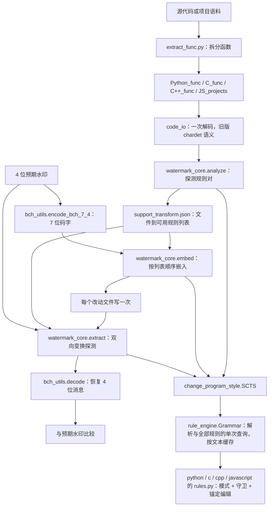

# CLLMark 代码地图

本地图描述仓库根目录的实现（旧版论文方法，规则层已重构）。`data/` 保留另一份旧实验快照，不使用根目录的新模块。论文版本与方法差异见 [PAPER_ALIGNMENT.md](PAPER_ALIGNMENT.md)。

日常实验使用新增的 [科研循环](RESEARCH_LOOP.md)，由冻结副本调用这些旧入口；不要运行其带有硬编码路径的批量主程序。

## 方法到代码的数据流



`folder_transform_check.py`、`watermark_bit.py`、`watermark_extract.py` 保留原函数签名，作为文件目录与内存流程之间的薄适配层：读取目录一次、调用 `watermark_core`、写出结果一次。图中的“预期水印”和 `support_transform.json` 仍是当前提取协议的输入；它们与新版论文的独立提取定义不能等同。

## 核心模块导航

| 模块 | 关键入口 | 职责 |
| --- | --- | --- |
| [rule_engine.py](../rule_engine.py) | `Rule`、`Matcher`、`Guard`、`Grammar`、`apply_edits` | 规则表示（tree-sitter 查询 + 具名守卫 + 锚定编辑）、按语言编译单个查询、原子编辑组与冲突处理、解析缓存。设计与规则目录见 [RULES.md](RULES.md)。 |
| [change_program_style.py](../change_program_style.py) | `SCTS` | 样式编号到规则的前端：`change_file_style`（返回代码、是否非空白变化、候选数）、`get_file_popularity`（检测型子规则 11/12 使用的目标形式计数）、`get_func_block`、`check_syntax`。解析库取 `./build`（冻结运行）或 `.benchmark-cache/toolchain` 的固定构建。 |
| [watermark_core.py](../watermark_core.py) | `analyze`、`embed`、`extract`、`probe`、`slots` | 内存中的分析、嵌入和提取：槽位顺序、比特到子规则映射、冲突随机取位与旧脚本一致；规则异常的探测结果为 `None`（该槽不产生码位）。 |
| [code_io.py](../code_io.py) | `read_source`、`write_source`、`reload_written` | 与 `open(encoding=chardet.detect(...))` 相同的解码（纯 ASCII 快速路径），写入后再读取的语义在内存中复现。 |
| [folder_transform_check.py](../folder_transform_check.py) | `check_support_transform` | 写出目录的 `support_transform.json` 并返回容量。 |
| [watermark_bit.py](../watermark_bit.py) / [watermark_extract.py](../watermark_extract.py) | `folder_bit_watermark` / `folder_bit_extract` | 目录级嵌入与提取适配层（基准适配器调用这些入口）。 |
| [bch_utils.py](../bch_utils.py) | `encode_bch_7_4`、`decode` | 固定 BCH(7,4,1)，`G=0b1011`。 |
| [rule_dict_bit_acc.py](../rule_dict_bit_acc.py) | `rule_dict` | 每种语言的水印对 `[比特 0 样式, 比特 1 样式]`，字典顺序即槽位顺序；分析与嵌入共用（原 `rule_dict.py` 与其成员一致，已合并）。 |
| [styleList.json](../styleList.json) | 语言 → 编号 → `[类别, 名称]` | 样式目录；测试检查它与规则模块一致。 |
| [tools/rule_audit.py](../tools/rule_audit.py) | CLI | 全量语料上的适用数、自然形式、幂等、可逆、语法与规则间干扰审计。 |

## 语言规则与注册方式

每种语言一个模块，`RULES` 以样式编号为键：

| 模块 | 内容 | 水印对 |
| --- | --- | --- |
| [python/rules.py](../python/rules.py) | 原有打印、列表/字典、range、切片、字符串、运算、返回规则；新增 14–21（成员/身份否定、分支与条件交换、sum/range 默认参数、while 退出形式、else-after-return） | 25（原 17） |
| [c/rules.py](../c/rules.py) | C 家族共享规则（运算、自增、main、声明、循环、switch）及 C 的数组/指针规则；新增 14–20 | C 21（原 14） |
| [cpp/rules.py](../cpp/rules.py) | 共享规则的 C++ 方言、stdio/iostream；新增 21（typedef/using）、22（转换形式） | 22（原 14） |
| [javascript/rules.py](../javascript/rules.py) | 由 C/Python 规则改编并新增成员访问、属性简写等 | 15 |

扩展规则的步骤与检查见 [RULES.md](RULES.md#新增或修改规则的流程)。旧的 `transform*.py`、`config.py`、`utils.py`、`rule_dict.py` 已由上述模块取代；差分验证与基准结果见 [实验记录](experiments/2026-10-rule-engine.md)。

## 数据准备与实验入口

| 文件或目录 | 用途 | 运行方式和当前限制 |
| --- | --- | --- |
| [extract.py](../extract.py) | 从 MBXP JSONL 的 `canonical_solution` 拆出代码文件。 | 参数位于模块顶层，导入即执行。 |
| [extract_func.py](../extract_func.py) | 从项目源码提取函数，写入 `*_func` 目录。 | 模块顶层遍历；默认输入 `WareHouse_C++` 当前不在仓库中。 |
| [short_code_filter.py](../short_code_filter.py) | 去除空行、注释/import，删除过短源码。 | 会修改或删除文件，需要先检查文件末尾的参数。 |
| [openai_ml.py](../openai_ml.py) | 并发调用兼容 OpenAI API 生成 C++ completion。 | 读取 `OPENAI_API_KEY`；输入文件默认不在根目录；输出文件名含 `python`，但实际语言字段为 `cpp`。 |
| [code_transform_provider.py](../code_transform_provider.py#L132) | 批量变换目录，记录耗时、成功数和节点数。 | 默认 C++、`test` → `test_1`、风格 `9.1`；部分替代 AST 变换分支未完成。 |
| [benchmark_passrate.py](../benchmark_passrate.py) | 变换、导出 JSONL、调用 MXEval 的功能正确性评估。 | 有 Linux/Windows 绝对路径和模块顶层执行；主转换分支存在重复的 `== '11'` 条件，不能直接作为可靠批量基准。 |
| [folder_to_jsonl.py](../folder_to_jsonl.py#L5) | 导出 `task_id`、`completion`、`language`。 | `EXT` 应传不带点的扩展名，现有某些调用传 `.py` 会匹配成 `..py`。 |
| [error_check.py](../error_check.py) | 比较两个评估结果文件中同一任务的通过状态。 | 模块顶层使用旧 Windows 路径。 |
| [calu.py](../calu.py)、[test.py](../test.py) | 从预设数字计算 TPR/FPR/ACC 或混淆矩阵。 | 是实验计算脚本，不是自动化测试套件。 |
| [fortowhile.py](../fortowhile.py)、[transform_list_comprehensions.py](../transform_list_comprehensions.py) | Python AST 变换辅助工具。 | 属于辅助实现，不能与 Tree-sitter CST 核心流程直接等同。 |
| [build_so.py](../build_so.py) | 手动编译 Tree-sitter 库的历史脚本。 | 使用旧绝对路径；常规解析库构建也存在于 `SCTS.__init__`。 |
| [dataset/](../dataset/) | MBPP/MBCPP/CodeNet 代码与生成/评估 JSONL。 | 目录标签保留原样；`G/H/G_L/W` 等后缀的全部来源不能仅由名称确认。 |
| [Python_func/](../Python_func/)、[C_func/](../C_func/)、[C++_func/](../C++_func/) | 项目拆分后的函数级代码及支持表。 | 分别包含 7506 个 `.py`、5478 个 `.c`、6269 个 `.cpp` 文件；这是本地快照数量，不等同于论文样本数。 |
| [Python_func_test/](../Python_func_test/) | Python 水印实验语料。 | 根目录三个主要水印脚本的默认目标；包含 7465 个 `.py` 文件。 |
| `output_json*`、`generations(2).json` | 已有生成及评估结果。 | 作为历史材料保存；未重新生成或确认与论文表格逐项对应。 |

## 新增的科研循环模块

| 模块 | 职责 |
| --- | --- |
| [Makefile](../Makefile)、[tools/research_loop.py](../tools/research_loop.py) | 测试、抽样、全量、基线、比较、续跑、前台监控入口 |
| [tools/setup_benchmark.py](../tools/setup_benchmark.py) | 固定依赖与 Tree-sitter 语法提交，构建本机解析库 |
| [benchmarks/common.py](../benchmarks/common.py) | 非破坏性语料清单、版本摘要、环境验证和原子文件写入 |
| [benchmarks/runner.py](../benchmarks/runner.py) | 源码/输入冻结、并行执行、逐行续跑、运行后原始输入校验 |
| [benchmarks/engine.py](../benchmarks/engine.py) | 调用真实旧入口，记录容量、码位、随机设置、结构性质及反向变换攻击 |
| [benchmarks/utility.py](../benchmarks/utility.py) | Python/C++/JavaScript MBXP 测试拼接、编译或语法检查和执行，JavaScript 项目/仓库文件自带测试套件（水印文件覆盖到固定检出）、Exercism Jest spec，超时及内容摘要缓存 |
| [tools/setup_javascript.py](../tools/setup_javascript.py)、[benchmarks/javascript.lock.json](../benchmarks/javascript.lock.json)、[benchmarks/js-locks/](../benchmarks/js-locks) | lodash、JavaScript 小项目（git 提交）、中型仓库与 Exercism（tarball SHA-256 + 锁文件，`--ignore-scripts`）的固定来源与依赖；源码复制到 `dataset/JS_projects`、`dataset/JS_repos`、`dataset/Exercism_JS` |
| [tools/js_corpus_inventory.py](../tools/js_corpus_inventory.py) | JavaScript 各组与各仓库的单元数、行数分布及容量分布（TSV） |
| [tools/import_mbjsp.py](../tools/import_mbjsp.py) | 由 MBJSP 题目与生成结果构建 `dataset/MBJSP_G`、`MBJSP_H` |
| [benchmarks/metrics.py](../benchmarks/metrics.py) | 显式分母、失败 ID、分组指标、CSV/Markdown/图表 |
| [benchmarks/compare.py](../benchmarks/compare.py) | 可比性校验、分组和汇总门禁、显式基线提升与历史归档 |
| [tests/test_research_loop.py](../tests/test_research_loop.py) | oracle 缺失、隐藏回退、文件完整性、真实功能执行（含 Node）及超时等流程检查 |
| [tests/test_pipeline.py](../tests/test_pipeline.py)、[tests/test_rule_engine.py](../tests/test_rule_engine.py) | 解码与读写语义、内存流程、编辑冲突语义、规则目录一致性、扩展规则互逆和示例改写 |

框架向分析/嵌入/提取模块注入每个 worker 内缓存的 `SCTS`；BCH 解码只做观测包装，不替换结果。每个单元复制到独立平面目录，再由适配层产生 `support_transform.json`。规则模块不保存模块级可变状态，`reset_legacy_state` 只对仍以 `transform*` 命名的旧模块生效（当前没有）。

## `data/` 实验快照

根目录的 21 个 Python 脚本在 `data/` 下都有同名文件。建库前其中 17 个内容相同，4 个不同：

| 文件 | 根目录版本 | `data/` 版本 |
| --- | --- | --- |
| `watermark_bit.py` | `lang='python'`，`Python_func_test` | `lang='c'`，`C_func_test2` |
| `watermark_extract.py` | `lang='python'`，`Python_func_test` | `lang='c'`，`C_func_test2` |
| `folder_transform_check.py` | 分析 Python 语料 | 分析 C 语料，并额外打印变换编号 |
| `code_transform_provider.py` | C++ 风格 `9.1` | C 风格 `5.4`，开启差异显示 |

`data/` 还保存 C/C++ 的 `*_func_test`、`*_func_test2` 等数据。此次保留这些材料，不将两个脚本版本合并。源码索引覆盖根目录主实现、工具、科研循环和流程测试，不对每份语料源码建立重复的调用图。

## 运行前需要确认的事项

1. 解析库：`SCTS` 依次使用 `./build/<语言>-languages.so` 与 `.benchmark-cache/toolchain` 中的固定构建；两者都没有时报错并提示运行 `tools/setup_benchmark.py`，不再在运行时克隆未固定版本的语法仓库或调用系统安装命令。
2. `watermark_core.embed` 不会因变换失败把已消耗码位放回队列；不足 7 个可用规则时也没有完整的失败返回协议。冲突提取状态随机选位（固定种子下可复现）。
3. `SCTS.change_file_style` 传入多个风格时按顺序组合应用（旧实现每轮都作用于原始代码，只返回最后一个风格的结果）；水印流程逐条调用单个规则。
4. Tree-sitter 的语法正确不等于程序语义等价。`tools/rule_audit.py` 检查结构性质（幂等、可逆、互不干扰）；语义依据见 [RULES.md](RULES.md)，功能层面以 MBXP 与项目测试验证。

## 维护机器可读索引

```bash
python3 tools/build_code_index.py
python3 tools/build_code_index.py --check
```

[code-index.json](code-index.json) 使用确定性排序，包含源码 SHA-256、符号行号、导入及可解析的本地模块依赖。它通过 AST 静态解析生成，不导入研究模块，不执行语料变换或外部 API 调用；动态语言注册与数据流仍以本地图的人工说明为准。
