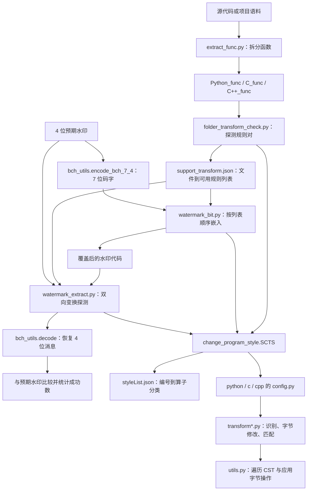

# CLLMark 代码地图

本地图以仓库根目录的旧版实现为主。`data/` 保留另一份实验快照；两者不是经过抽象的统一实现。论文版本与方法差异见 [PAPER_ALIGNMENT.md](PAPER_ALIGNMENT.md)。

## 方法到代码的数据流



图中的“预期水印”和 `support_transform.json` 是当前代码的真实依赖。旧版论文的算法描述、新版论文的独立提取定义与此实现不能直接等同。

## 核心模块导航

| 模块 | 关键入口 | 职责与读写行为 |
| --- | --- | --- |
| [change_program_style.py](../change_program_style.py#L17) | `SCTS` | 初始化 Tree-sitter；根据语言导入规则；加载 `styleList.json`。缺少解析库时会克隆语法仓库并编译。 |
| [change_program_style.py](../change_program_style.py#L88) | `SCTS.change_file_style` | 将风格编号映射到识别/转换函数，生成字节编辑操作，返回 `(code, succ, transform_num)`。 |
| [change_program_style.py](../change_program_style.py#L51) | `SCTS.get_file_popularity` | 使用第三个匹配函数统计目标风格节点数量；特殊循环规则的检测依赖此接口。 |
| [change_program_style.py](../change_program_style.py#L129) | `SCTS.get_func_block` | 使用风格 `13` 提取函数名与函数源码，对重名函数添加后缀。 |
| [utils.py](../utils.py) | `traverse_rec_func`、`replace_from_blob` | 遍历树节点；将 `(位置, 插入文本或删除位置)` 操作作用于 UTF-8 字节串。 |
| [folder_transform_check.py](../folder_transform_check.py#L95) | `check_support_transform` | 对每个文件探测规则对，写出该目录的 `support_transform.json`。 |
| [folder_transform_check.py](../folder_transform_check.py#L45) | `get_sorted_files_by_sha256` | 按**文件名**的无盐 SHA-256 排序；不是按文件内容或加盐规则元数据排序。 |
| [watermark_bit.py](../watermark_bit.py#L77) | `folder_bit_watermark` | BCH 编码后，按支持表中保存的文件/规则顺序消耗码位并覆盖源文件。 |
| [watermark_extract.py](../watermark_extract.py#L76) | `folder_bit_extract` | 接收预期 `bit_list`；对相反子规则分别尝试转换，恢复位并与预期水印比较。冲突状态随机取位。 |
| [bch_utils.py](../bch_utils.py) | `encode_bch_7_4`、`decode` | 生成多项式 `0b1011`；4 位消息编码为 7 位码字， syndrome 表支持单比特纠错。 |
| [rule_dict.py](../rule_dict.py) | `rule_dict` | 可用性分析使用的规则对清单：Python 17 对，C/C++ 各 14 对。 |
| [rule_dict_bit_acc.py](../rule_dict_bit_acc.py) | `rule_dict` | 嵌入/提取使用的 0/1 子规则编号顺序；部分规则与分析表顺序相反。 |
| [styleList.json](../styleList.json) | 语言 → 编号 → `[类型, 子类型]` | Python 41、C 40、C++ 43 个编号。编号数不是水印规则对数。 |
| [support_transform.json](../support_transform.json) | 文件名 → 规则名称数组 | 根目录已有实验支持表；实际流程按每个项目目录读取该文件。 |

`get_trans_num(rule, bit, language)` 在嵌入和提取脚本中实际读取模块全局变量 `lang`，直接导入调用前需要注意这一依赖。

## 语言规则与注册方式

每个语言的 `config.py` 注册 `transformation_operators[类型][子类型] = (rec, cvt, match)`。`rec_*` 识别可转换节点，`cvt_*` 生成字节修改操作，`match_*` 或对应识别函数判断目标状态。风格编号通过 `styleList.json` 找到注册项，水印规则再通过两个 `rule_dict` 文件关联到成对子规则。

| 目录 | 规则实现分组 | 静态注册项 |
| --- | --- | --- |
| [python/](../python/) | `transform0_var` 命名；`1_print` 打印；`2_list` 列表；`3_dict` 字典；`4_range` 范围/索引；`5_call` 调用；`6_string` 字符串；`7_op` 运算；`8_for` 循环；`9_declare` 赋值；`10_return` 返回；`13_fun` 函数提取。并非所有文件都被 `config.py` 导入。 | 44 |
| [c/](../c/) | `transform0_var` 命名；`1_blank` 空白/括号；`2_op` 运算；`3_update` 自增；`4_main` 主函数；`5_array` 数组/指针；`6_declare` 声明；`7_loop` 循环；`8_if` 条件；`13_fun` 函数提取。 | 42 |
| [cpp/](../cpp/) | 类似 C，并增加 `transform9_cpp` 的 C++ 输入输出、头文件及命名空间规则。 | 48 |

这些数字统计注册表中的子算子，包含非水印用途的算子；不能解释为经过语义等价验证的 RSPT 数量。

扩展规则时需要同时核对：语言 `transform*.py` 的节点条件、该语言 `config.py` 的注册项、`styleList.json` 的编号、两份 `rule_dict` 的规则对及位映射。仅新增转换函数不会自动进入水印流程。旧稿附录 D 的 G/P/C 编号与代码风格编号是不同体系，需通过规则含义建立对应关系。

## 数据准备与实验入口

| 文件或目录 | 用途 | 运行方式和当前限制 |
| --- | --- | --- |
| [extract.py](../extract.py) | 从 MBXP JSONL 的 `canonical_solution` 拆出代码文件。 | 参数位于模块顶层，导入即执行。 |
| [extract_func.py](../extract_func.py) | 从项目源码提取函数，写入 `*_func` 目录。 | 模块顶层遍历；默认输入 `WareHouse_C++` 当前不在仓库中。 |
| [short_code_filter.py](../short_code_filter.py) | 去除空行、注释/import，删除过短源码。 | 会修改或删除文件，需要先检查文件末尾的参数。 |
| [openai_ml.py](../openai_ml.py) | 并发调用兼容 OpenAI API 生成 C++ completion。 | 读取 `OPENAI_API_KEY`；输入文件默认不在根目录；输出文件名含 `python`，但实际语言字段为 `cpp`。 |
| [code_transform_provider.py](../code_transform_provider.py#L132) | 批量变换目录，记录耗时、成功数和节点数。 | 默认 C++、`test` → `test_1`、风格 `9.1`；部分替代 AST 变换分支未完成。 |
| [benchmark_passrate.py](../benchmark_passrate.py) | 变换、导出 JSONL、调用 MXEval 的功能正确性评估。 | 有 Linux/Windows 绝对路径和模块顶层执行；主转换分支存在重复的 `== '11'` 条件，不能直接作为可靠批量基准。 |
| [folder_to_jsonl.py](../folder_to_jsonl.py#L5) | 导出 `task_id`、`completion`、`language`。 | `EXT` 应传不带点的扩展名，现有某些调用传 `.py` 会匹配成 `..py`。 |
| [error_check.py](../error_check.py) | 比较两个评估结果文件中同一任务的通过状态。 | 模块顶层使用旧 Windows 路径。 |
| [calu.py](../calu.py)、[test.py](../test.py) | 从预设数字计算 TPR/FPR/ACC 或混淆矩阵。 | 是实验计算脚本，不是自动化测试套件。 |
| [fortowhile.py](../fortowhile.py)、[transform_list_comprehensions.py](../transform_list_comprehensions.py) | Python AST 变换辅助工具。 | 属于辅助实现，不能与 Tree-sitter CST 核心流程直接等同。 |
| [build_so.py](../build_so.py) | 手动编译 Tree-sitter 库的历史脚本。 | 使用旧绝对路径；常规解析库构建也存在于 `SCTS.__init__`。 |
| [dataset/](../dataset/) | MBPP/MBCPP/CodeNet 代码与生成/评估 JSONL。 | 目录标签保留原样；`G/H/G_L/W` 等后缀的全部来源不能仅由名称确认。 |
| [Python_func/](../Python_func/)、[C_func/](../C_func/)、[C++_func/](../C++_func/) | 项目拆分后的函数级代码及支持表。 | 分别包含 7506 个 `.py`、5478 个 `.c`、6269 个 `.cpp` 文件；这是本地快照数量，不等同于论文样本数。 |
| [Python_func_test/](../Python_func_test/) | Python 水印实验语料。 | 根目录三个主要水印脚本的默认目标；包含 7465 个 `.py` 文件。 |
| `output_json*`、`generations(2).json` | 已有生成及评估结果。 | 作为历史材料保存；未重新生成或确认与论文表格逐项对应。 |

## `data/` 实验快照

根目录的 21 个 Python 脚本在 `data/` 下都有同名文件。建库前其中 17 个内容相同，4 个不同：

| 文件 | 根目录版本 | `data/` 版本 |
| --- | --- | --- |
| `watermark_bit.py` | `lang='python'`，`Python_func_test` | `lang='c'`，`C_func_test2` |
| `watermark_extract.py` | `lang='python'`，`Python_func_test` | `lang='c'`，`C_func_test2` |
| `folder_transform_check.py` | 分析 Python 语料 | 分析 C 语料，并额外打印变换编号 |
| `code_transform_provider.py` | C++ 风格 `9.1` | C 风格 `5.4`，开启差异显示 |

`data/` 还保存 C/C++ 的 `*_func_test`、`*_func_test2` 等数据。此次保留这些材料，不将两个脚本版本合并。源码索引覆盖根目录主实现与工具目录，不对每份语料源码建立重复的调用图。

## 运行前需要确认的事项

1. 主流程依赖当前工作目录：`build/`、`styleList.json` 和语料路径均使用相对路径。
2. `SCTS` 中存在自动克隆、构建语法库、调用系统安装命令和删除语法目录的逻辑；在 macOS 上需要先核对这些旧环境假设。
3. 代码虽然声明 `java` 语言选项，但仓库缺少 `java/config.py`，不能视作已支持 Java。
4. `watermark_bit.py` 不会因变换失败而把已消耗码位放回队列；不足 7 个可用规则时也没有完整的失败返回协议。冲突提取状态会随机选位。
5. `SCTS.change_file_style` 传入多个风格时，每轮解析的是最初的 `format_code`，需要另行核对组合变换行为；现有水印脚本逐条调用单个规则。
6. Tree-sitter 的语法正确不等于程序语义等价。规则可逆性、幂等性、互不干扰、代码效用及论文检测指标需要独立实验验证。

## 维护机器可读索引

```bash
python3 tools/build_code_index.py
python3 tools/build_code_index.py --check
```

[code-index.json](code-index.json) 使用确定性排序，包含源码 SHA-256、符号行号、导入及可解析的本地模块依赖。它通过 AST 静态解析生成，不导入研究模块，不执行语料变换或外部 API 调用；动态语言注册与数据流仍以本地图的人工说明为准。
