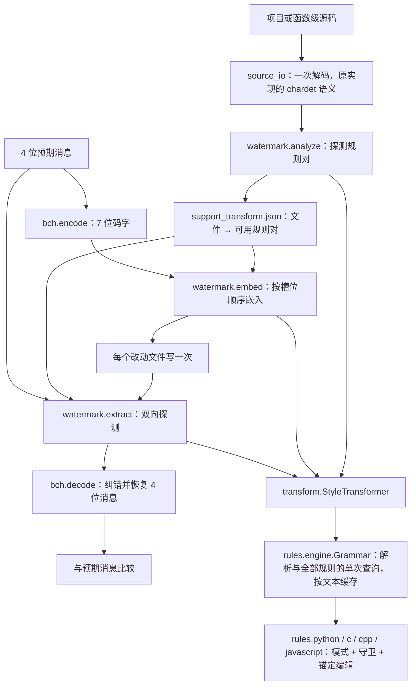

# CLLMark 代码地图

本地图描述 `cllmark/` 包（旧版论文方法，规则层已重构）、评估循环与工具。论文版本与方法差异见 [PAPER_ALIGNMENT.md](PAPER_ALIGNMENT.md)；日常实验使用 [科研循环](RESEARCH_LOOP.md)，它在冻结副本中调用本包。

## 方法到代码的数据流



`directories` 把这些步骤落到平面目录：读取目录一次、调用 `watermark`、写出结果一次。图中的“预期消息”和 `support_transform.json` 是当前提取协议的输入，与新版论文的独立提取定义不能等同。

## 核心包 `cllmark/`

| 模块 | 关键入口 | 职责 |
| --- | --- | --- |
| [watermark.py](../cllmark/watermark.py) | `analyze`、`embed`、`extract`、`probe`、`slots`、`project_order` | 内存中的分析、嵌入和提取：槽位顺序（按文件名 SHA-256）、比特到规则的映射、无法判定时随机取位，与原实现一致；规则异常的探测结果为 `None`（该槽不产生码位）。通过模块属性调用 `bch.encode`/`bch.decode`，评估循环据此记录原始码字。 |
| [transform.py](../cllmark/transform.py) | `StyleTransformer`、`load_rules`、`library_path` | 样式编号到规则：`apply`（返回代码、是否非空白变化、候选数）、`count_target_form`（检测型样式 11/12 的目标形式计数）、`check_syntax`。解析库取 `./build`（冻结运行）或 `.benchmark-cache/toolchain` 的固定构建。 |
| [directories.py](../cllmark/directories.py) | `analyze_directory`、`embed_directory`、`extract_directory`、`load_project` | 目录级流程；分析写出 `support_transform.json` 并返回容量，可传入共享的 `StyleTransformer`。 |
| [cli.py](../cllmark/cli.py) | `main` | `python -m cllmark analyze/embed/extract`；输入目录只读，`embed` 写到新的输出目录。 |
| [bch.py](../cllmark/bch.py) | `encode`、`decode`、`remainder` | 系统 BCH(7,4,1)（汉明码），生成多项式 `x^3 + x + 1`，单比特纠错。 |
| [source_io.py](../cllmark/source_io.py) | `read_source`、`write_source`、`reload_written` | 与 `open(encoding=chardet.detect(...))` 相同的解码（纯 ASCII 快速路径），写后再读的语义在内存中复现。 |
| [rules/engine.py](../cllmark/rules/engine.py) | `Rule`、`Matcher`、`Guard`、`Grammar`、`apply_edits` | 规则表示（tree-sitter 查询 + 具名守卫 + 锚定编辑）、按语言编译单个查询、原子编辑组与冲突处理、解析缓存。设计见 [RULES.md](RULES.md)。 |
| [rules/pairs.py](../cllmark/rules/pairs.py) | `WATERMARK_PAIRS` | 每种语言的水印对 `(比特 0 样式, 比特 1 样式)`，顺序即槽位顺序。 |
| [rules/styles.json](../cllmark/rules/styles.json) | 语言 → 编号 → `[类别, 名称]` | 样式目录；测试检查它与规则模块、水印对一致。 |

## 语言规则

每种语言一个模块，`RULES` 以样式编号为键：

| 模块 | 内容 | 水印对 |
| --- | --- | --- |
| [rules/python.py](../cllmark/rules/python.py) | 打印、列表/字典、range、切片、字符串、运算、返回；新增 14–21（成员/身份否定、分支与条件交换、sum/range 默认参数、while 退出形式、else-after-return） | 25 |
| [rules/c.py](../cllmark/rules/c.py) | C 家族共享规则（运算、自增、main、声明、循环、switch）及 C 的数组/指针规则；新增 14–20 | 21 |
| [rules/cpp.py](../cllmark/rules/cpp.py) | 共享规则的 C++ 方言、stdio/iostream；新增 21（typedef/using）、22（转换形式） | 22 |
| [rules/javascript.py](../cllmark/rules/javascript.py) | 由 C/Python 规则改编并新增成员访问、属性简写、箭头函数、const/let 等 | 25 |

扩展规则的步骤与检查见 [RULES.md](RULES.md#新增或修改规则的流程)。

## 评估循环 `benchmarks/` 与工具 `tools/`

| 模块 | 职责 |
| --- | --- |
| [Makefile](../Makefile)、[tools/research_loop.py](../tools/research_loop.py) | 测试、抽样、全量、基线、比较、续跑、前台监控入口 |
| [tools/setup_benchmark.py](../tools/setup_benchmark.py) | 固定依赖与 tree-sitter 语法提交，构建本机解析库 |
| [tools/setup_javascript.py](../tools/setup_javascript.py)、[benchmarks/javascript.lock.json](../benchmarks/javascript.lock.json)、[benchmarks/js-locks/](../benchmarks/js-locks) | lodash、JavaScript 小项目（git 提交）、中型仓库与 Exercism（tarball SHA-256 + 锁文件，`--ignore-scripts`）的固定来源与依赖；源码写入 `corpus/dataset/JS_projects`、`JS_repos`、`Exercism_JS` |
| [benchmarks/common.py](../benchmarks/common.py) | 非破坏性语料清单、版本摘要、环境验证和原子文件写入 |
| [benchmarks/runner.py](../benchmarks/runner.py) | 源码/输入冻结、并行执行、逐行续跑、运行后原始输入校验 |
| [benchmarks/engine.py](../benchmarks/engine.py) | 在冻结副本中调用 `cllmark`，记录容量、码位、随机设置、结构性质及反向变换攻击 |
| [benchmarks/utility.py](../benchmarks/utility.py) | MBXP（Python/C++/JavaScript）测试拼接与执行、JavaScript 项目与仓库文件的自带测试套件、Exercism Jest spec、超时与内容摘要缓存 |
| [benchmarks/metrics.py](../benchmarks/metrics.py) | 显式分母、失败 ID、分组指标、CSV/Markdown/图表 |
| [benchmarks/compare.py](../benchmarks/compare.py) | 可比性校验、分组和汇总门禁、显式基线提升与历史归档 |
| [tools/rule_audit.py](../tools/rule_audit.py) | 全量语料上的适用数、自然形式、幂等、可逆、语法与规则间干扰审计 |
| [tools/lost_capacity_report.py](../tools/lost_capacity_report.py) | 对比两次运行，解释失去容量的单元与槽位 |
| [tools/js_rule_check.py](../tools/js_rule_check.py)、[tools/js_corpus_inventory.py](../tools/js_corpus_inventory.py) | JavaScript 规则在真实语料上的位序、容量与功能检查；各组单元与容量分布 |
| [tools/import_mbjsp.py](../tools/import_mbjsp.py) | 由 MBJSP 题目与生成结果构建 `corpus/dataset/MBJSP_G`、`MBJSP_H` |
| [tools/build_code_index.py](../tools/build_code_index.py) | 生成 [code-index.json](code-index.json) |
| [tests/](../tests) | 解码与读写语义、BCH、目录与命令行流程、编辑冲突语义、规则目录一致性、扩展规则互逆与示例改写、评估循环的有效性与完整性检查 |

评估循环为每个 worker 缓存一个 `StyleTransformer` 并传给 `directories` 的各函数；BCH 解码只做观测包装，不替换结果。每个单元复制到独立平面目录，再由 `analyze_directory` 产生 `support_transform.json`。规则模块不保存模块级可变状态（`test_rules_have_no_state_between_files`）。

## 语料 `corpus/`

语料位于私有数据仓库 [Noelle1831-k/CLLMark-legacy-data](https://github.com/Noelle1831-k/CLLMark-legacy-data)，以子模块挂载在 `corpus/`（`make corpus`）。

| 目录 | 内容 |
| --- | --- |
| `corpus/dataset/` | MBPP/MBCPP/MBCP/CodeNet/MBJSP 代码、JavaScript 项目与仓库、Exercism、各组 JSONL；目录标签保留原样，`G/H/G_L/W` 等后缀的全部来源不能仅由名称确认 |
| `corpus/Python_func/`、`C_func/`、`C++_func/` | 项目拆分后的函数级代码（本地快照数量，不等同于论文样本数） |
| `corpus/Python_func_test/`、`corpus/data/` | 历史项目级语料；`corpus/data/` 还保存原实现另一份实验快照的脚本副本 |
| `provenance/`（数据仓库根目录） | 原实现中生成语料与旧实验的一次性脚本、环境记录及其历史结果，附用途与已知限制说明 |

## 运行前需要确认的事项

1. 解析库：`StyleTransformer` 依次使用 `./build/<语言>-languages.so` 与 `.benchmark-cache/toolchain` 中的固定构建；都没有时报错并提示运行 `tools/setup_benchmark.py`。
2. 部分 C/C++ 规则沿用原实现的 `list(集合)[0]`，输出依赖 Python 字符串哈希种子；评估循环固定 `PYTHONHASHSEED`，其他场景需要可复现输出时请同样设置。
3. `watermark.embed` 不会因变换失败把已消耗的码位放回队列；可用规则不足 7 个时没有完整的失败返回协议（命令行在容量不足时拒绝嵌入）。无法判定的槽位随机取位（固定种子下可复现）。
4. `StyleTransformer.apply` 传入多个样式时按顺序组合应用；水印流程逐条调用单个样式。
5. tree-sitter 的语法正确不等于语义等价：`tools/rule_audit.py` 检查结构性质（幂等、可逆、互不干扰），语义依据见 [RULES.md](RULES.md)，功能层面以真实测试验证。

## 维护机器可读索引

```bash
python3 tools/build_code_index.py
python3 tools/build_code_index.py --check
```

[code-index.json](code-index.json) 使用确定性排序，包含源码 SHA-256、符号行号、导入及可解析的本地模块依赖。它通过 AST 静态解析生成，不导入研究模块；动态的语言注册与数据流以本地图的说明为准。
