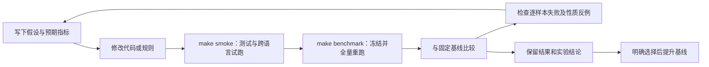

# 本地科研循环与全量 benchmark

本流程对**当前实现的旧版论文方法**（规则层已重构并扩展，见 [RULES.md](RULES.md)）进行重复测量，直接调用真实的可用性分析、嵌入和提取入口。每次算法或规则改动完成后执行 `make benchmark`，结果与固定参考比较。它不是新版论文实现，也不声称重现论文表格。



## 一次性准备与日常命令

在仓库根目录执行。需要 Python 3.11、C++ 编译器和 Node.js；有 `uv` 时优先使用它，无 `uv` 时使用 venv/pip。

```bash
make corpus           # 拉取固定提交的语料子模块 corpus/（私有仓库 CLLMark-legacy-data）
make setup-benchmark  # 安装独立环境，按固定提交构建本机 Tree-sitter 语法库（含 JavaScript）
make setup-javascript # lodash、JavaScript 小项目与 14 个中型仓库（按提交下载并校验 tarball，--ignore-scripts 安装依赖，跑一次干净测试）、Exercism 题库；幂等
make doctor          # 检查所有固定依赖、解析库及三种语言的实际规则导入
make inventory       # 查看全部 cohort 和实验单元数量
make smoke           # 每组 2 个单元，包含流程测试；不能作为全量结论
make baseline        # 首次全量运行并固定参考；已有参考时拒绝覆盖
```

本次初始参考建立后，每次代码改动完成只需：

```bash
make benchmark
```

也可记录本次假设，并调整并发数：

```bash
.venv-benchmark/bin/python tools/research_loop.py loop \
  --hypothesis '修复某条规则后，功能回退样本减少且水印恢复率不下降' --jobs 8
```

`loop` 先运行测试；`run` 直接运行实验，适用于已有验证记录的独立研究试验。`--limit N` 是每组抽样上限；`--cohort NAME` 可以重复指定。两种限制均使 `full=false`，不能通过全量门禁或提升为参考。

## 进度与实时日志

运行时终端显示进度条、速率（最近 60 秒滑动窗口）、已用时间和 ETA；交互终端原地刷新，重定向到文件时每 20 秒输出一行，非 `ok` 的单元立即输出。每个完成的单元还会追加到运行目录的 `progress.log`，`state.json` 同步记录总数、速率、ETA 及状态/组别计数。另开终端查看：

```bash
make progress                                   # 等价于 progress --follow，运行结束后自动退出
.venv-benchmark/bin/python tools/research_loop.py progress          # 最新运行的一次性快照
tail -f benchmark-results/<run_id>/progress.log # 逐单元实时日志
```

## 并行与内存盘

准备阶段的各步骤都使用本机全部硬件线程（`os.cpu_count()`）：单元测试由 `tools/run_tests.py` 按测试方法轮流分给每个线程一个 `unittest` 进程；冻结时语料和源码在线程池里并行读取、计算 SHA-256 并写入；实验阶段 `--jobs` 默认等于线程数（显式 `--jobs N` 仍然有效）。`jobs` 与基线不同只会使计时不可比，不影响其他指标。

冻结后不再重复校验哈希：每个输入的 SHA-256 在复制时只算一次，写入清单作为语料身份（语料变化会使基线不可比，所以保留）；执行前不再重算冻结副本、每个单元读取输入时不再核对、运行后不再重读原始输入。仍然检查的只有清单自身摘要和运行后的源码摘要是否与冻结时一致（`AGENTS.md` 要求的源码版本标识）。因此运行期间原始语料被改动不会被发现，已保存的快照被改动也不会被发现。

```bash
make benchmark-ram                                  # 运行目录和临时文件放在内存盘，结束后拷回 benchmark-results/
make benchmark-ram ARGS='--hypothesis "说明" --jobs 12'
```

macOS 使用 `hdiutil` 创建 3 GB 内存盘（`/Volumes/CLLMarkRAM`），Linux 使用 `/dev/shm`。结束后拷回结果并卸载；拷回失败则保留内存盘并提示位置。拷回不含 `inputs/` 与 `work/`（清单仍列出全部输入文件及其摘要），因此内存盘运行的结果不能 `resume`；需要完整快照时加 `tools/benchmark_ram.py --keep-inputs`。功能测试缓存 `.benchmark-cache` 仍在硬盘上。`make progress` 会自动找到内存盘上的运行。

## 每次运行的内容

1. 锁定本地运行目录，防止两个循环同时竞争资源。
2. 执行流程测试并检查源码没有在测试期间变化。
3. 保存 Git 提交、工作区状态、所有算法/规则/框架源码、固定语法库、完整输入和功能测试目录（并行复制）。即使代码尚未提交，也以源码 SHA-256 标识该版本。
4. 使用冻结版本在独立子进程中运行。8 个 worker 各自加载解析器；水印处理始终重新执行。原始语料不会被变换或删除。
5. 对所有单元重新计算容量；容量不足仍保留在总量中。对可嵌入单元保存原始/水印/攻击代码、预期水印和实际提取码位。
6. 运行结构性质探测、本地 MBXP 功能测试和反向规则攻击；逐行保存结果，生成汇总、CSV、图表和基线对照。
7. 再次校验当前源码摘要。期间有变化的实验不能代表当前代码版本，也不能自动提升为参考。

功能测试按完整拼接代码、测试内容、依赖环境、编译器、超时和评估实现缓存。命中会在行结果中标记；超时不缓存。水印分析、嵌入、提取、规则性质及攻击不会被缓存。每个样本保留功能测试源码和输出，清理共享缓存后仍可阅读失败证据。

默认每次功能执行限时 3 秒，仅对超时再尝试一次；断言失败、运行错误和编译错误不重试。两轮的耗时、返回码和输出全部保存。首轮超时后重试通过的样本标记 `recovered_after_timeout`，汇总按判题记录统计重试和恢复（包含缓存复用），不能把首次超时删掉。该规则针对本机首次启动偶发耗时；最终仍超时的程序明确标记 TIMEOUT，不缓存。改变重试协议会导致旧参考不可比。

## 全量的定义与语料范围

默认配置 [config.json](../benchmarks/config.json) 包含 25 组、10,810 个本地实验单元（`corpus/` 子模块中的语料，见 [Noelle1831-k/CLLMark-legacy-data](https://github.com/Noelle1831-k/CLLMark-legacy-data)；桌面主检出另有 8 个从未入库的历史项目单元，不在其中）。函数级单元是一份文件，项目级单元是一个非空项目目录内的全部拆分函数（`js_repos` 为仓库内全部源文件），`project_file` 级单元是仓库中的一个源文件（见下）。空目录不构成可运行项目，清单会给出选中单元数。

| 组别 | 实验单元数 | 功能检查 |
| --- | ---: | --- |
| MBPP：G / G_L / H | 974 / 338 / 338 | 本地 MBXP Python 测试 |
| MBCPP：G / G_L / H | 848 / 484 / 484 | 本地 MBXP C++ 测试 |
| MBCP：G / W | 714 / 52 | 缺少 C 功能 oracle |
| CodeNet：G / H | 490 / 433 | 缺少已核实的 CNxxx 到 problem_id 映射 |
| C++ code_snippets | 729 | 缺少功能 oracle |
| Python / C / C++ 项目 | 500 / 437 / 458 | 拆分函数缺少项目依赖和 oracle |
| MBJSP：G / H | 112 / 938 | 本地 MBXP JavaScript 测试（Node，lodash） |
| JavaScript 项目（bytes、cookie、js-yaml、minimist） | 4 | 各项目自带测试套件，水印后的库文件覆盖到固定检出中运行 |
| JavaScript 仓库 `js_repos`（14 个固定提交的中型开源仓库） | 14 | 仓库自带测试套件；单元为仓库内全部手写源文件，保持目录结构 |
| JavaScript 仓库文件 `js_repo_files`（上述仓库中 ≥ 80 行的源文件） | 84 | 同一仓库测试套件，水印只在该文件内，覆盖到仓库原路径 |
| Exercism JavaScript `exercism_js`（参考解 ≥ 20 行） | 100 | 该题 Jest spec（按 Exercism CI 的方式启用 `xtest`），参考解替换为被测代码 |
| Python 历史项目 | 497 | 同上 |
| C 历史项目 test / test2 | 437 / 437 | 同上 |
| C++ 历史项目 test / test2 | 458 / 458 | 同上 |

**JavaScript 中型仓库与 Exercism 语料**（方案见 [2026-10-06-javascript-corpus.md](plans/2026-10-06-javascript-corpus.md)，入选/淘汰记录见 [selection](plans/2026-10-06-javascript-corpus.selection.md)，规模与容量分布见 [inventory.tsv](plans/2026-10-06-javascript-corpus.inventory.tsv)）：

- `benchmarks/javascript.lock.json` 的 `repositories` 固定每个仓库的 tag、commit、GitHub tarball SHA-256、许可证、源码 glob/排除、扩展名与依赖安装方式（仓库自带 `package-lock.json`，或 `benchmarks/js-locks/` 中固定的锁文件；无依赖的仓库不安装）；`exercism` 固定题库提交及 pnpm 锁文件，并记录 Aider Polyglot 子集（`Aider-AI/polyglot-benchmark` 固定提交）。测试命令与是否 `exclusive` 在 `config.json` 的 `projects`。
- `tools/setup_javascript.py` 只下载这些固定来源及其 npm/pnpm 依赖，一律 `--ignore-scripts`；干净测试必须通过，耗时与 V8 覆盖写入 `.benchmark-cache/js-projects/<name>.pin.json`；选中的源文件复制到 `corpus/dataset/JS_repos/<name>/`（附 LICENSE），Exercism 参考解写入 `corpus/dataset/Exercism_JS/`，题目元数据、spec 与支持文件写入 `corpus/dataset/Jsonl/exercism_javascript.jsonl`（被排除的题及原因在 `exercism_javascript_excluded.jsonl`）。第二次运行不下载、不改动。
- 项目级单元 `layout: tree`：legacy 流程在平面目录上工作，重复的基名（多个 `index.js`）按相对路径展平（`lib/a.js` 变为 `lib__a.js`），测试时还原为原路径。`project_file` 单元在 `min_lines`（80）行以上的文件上嵌入，其余文件保持仓库原样；干净文件不进入缓存键，同一仓库的干净运行共享一条缓存。
- 覆盖写入前若源文件是符号链接则先移除，绝不写穿到固定检出；复制检出时保留符号链接。绑定套接字的套件（express、ws、body-parser）标记 `exclusive`：并发副本会冲突固定端口，甚至偶发冲突临时端口，故用全局文件锁串行化，否则干净代码会出现伪 FAIL。
- `decimal.js`、`bignumber.js` 的测试脚本打印汇总后总是以 0 退出，命令用 `node -e` 包装器只在“`In total, N of N tests passed`”时返回 0。
- `exercism` oracle：在每个缓存项的工作区中放入固定检出的 `jest.config.js`/`babel.config.js`、spec（去掉 `xtest`/`xit`/`xdescribe` 标记，沿用 Exercism CI 的逐行首次替换；`.skip` 保持跳过）、支持文件（editor/lib/data）和被测代码，用固定版本的 Jest 只运行该题。
- 许可证、LOC（1,000–20,000 行）、干净测试通过、每项目 8 并发 ≤ 60 秒是入选条件；`.mjs/.cjs` 以外的构建产物、生成代码、需要构建步骤或子模块的测试（如 ajv 6）被排除。仓库内的容量集中在文件顺序靠前的少数文件：legacy 算法按文件名 SHA-256 顺序依次占用规则位，因此一个 `js_repos` 单元通常只改动 1–2 个文件，`js_repo_files` 才是逐文件的统计。

G/H 标签按现有目录约定定义为 generated/human。MBJSP_G 来自已有的 `generated_javascript_ark.jsonl`（966 条中 112 条有可用补全，其余为限流或无法解析）；MBJSP_H 为 MBJSP 参考解，与 MBCPP_H 的约定相同；JavaScript 项目为人工编写的开源库（role human）。W、`*_test*` 的历史变体标记为 historical，来源未确定的组标记为 unknown。historical 和 unknown 不进入检测混淆矩阵。语料组有重叠，尤其 G_L 与 G、历史变体之间；manifest 额外记录按文件名和内容摘要得到的去重单元数。**汇总值是本地回归套件指标，不是独立论文样本的统计估计。** 科研分析使用分组结果，并在新增来源证据时更新标签。

“全量”指所选配置中全部可运行单元，不包含再次调用模型生成、下载外部数据、重建原始完整项目，或覆盖未提供的论文攻击/对照方法。更换配置文件可以定义独立实验，但必须报告配置与语料版本。

## 度量及分母

| 指标 | 定义 |
| --- | --- |
| 容量覆盖率 | 成功分析且容量 ≥ 7 的单元 / 全部单元；框架错误仍在分母 |
| 水印恢复率 | BCH 解码后与配置的 4 位预期水印匹配 / 可嵌入单元 |
| 原始码字恢复率 / 位准确率 | 7 位完全匹配 / 可嵌入单元；正确位 / 已提取的预期码位总数 |
| TPR | generated 组新嵌入代码匹配 / 该组可嵌入单元 |
| FPR | human 组原始代码匹配 / 该组可嵌入单元 |
| 功能 oracle 覆盖率 | 实际有测试、获得 PASS/FAIL/编译错误/超时结论的原始单元 / 全部单元 |
| 功能保持率 | 原始测试通过且嵌入后仍通过 / 可配对且原始测试通过的单元 |
| 功能回退 | 原始 PASS、嵌入后非 PASS 的 ID；原来就错误的代码另行统计 |
| 语法保持率 | 原本 Tree-sitter 解析通过且嵌入后通过的文件 / 可嵌入单元中原本解析通过的文件 |
| 幂等性 | 每个可用规则的两个方向再次变换是否保持规范端点 |
| 规范端点可逆性 | 从一个规则端点变换到另一个，再返回是否得到同一规范端点 |
| 互不干扰 | 选中嵌入的 7 个 slot 中同文件规则两种执行顺序是否产生相同代码 |
| flip_1 / flip_2 | 成功应用 1/2 次相反规则变换后的消息匹配率；报告应用成功的覆盖数 |
| 时间 | 重新执行分析、嵌入、提取的毫秒中位数和 P95；排除解析器首次创建与功能检查 |

分母为零显示 `N/A`。`NO_TEST_ORACLE`、`NO_PROBLEM_MAPPING`、`NOT_EMBEDDED` 永远不算功能通过。C++ 语料中许多文件只含函数体：功能检查使用本地官方题目 prompt 还原签名并附加测试，提供 macOS 标准头文件兼容层；语法检查仍反映原始片段的 Tree-sitter 状态。JavaScript 单元保存完整函数（prompt 末行的签名加补全），测试先经 `node --check`（失败记为编译错误）再执行；项目与项目文件单元在固定检出的副本中运行该项目的测试命令（`config.json` 的 `projects`），超时为 `project_test_timeout_seconds`；Exercism 单元运行 Jest（`config.json` 的 `exercism`），同一超时。

旧提取依赖嵌入时的 `support_transform.json`，接收预期消息，冲突状态随机取位。流程固定总 seed、Python 哈希种子，并由单元 ID 和阶段派生提取种子；在各阶段开始前重置旧规则的模块全局状态，避免 worker 调度或性质探测影响后续嵌入。不把此结果称为独立提取或模型来源识别。结构性质探测不证明语义保持。11/12 特殊规则缺少通用转换实现，性质探测标记不支持；攻击仅统计实际成功的变换，不能假定一次变换恰好只改变一个码位。

## 门禁与基线

参考存于 `benchmarks/baselines/current.json`。只有全量、全部行完成、零运行框架错误且运行后校验通过的结果可以提升。已存在参考时 `make baseline` 不覆盖它。

比较要求语料、评估协议和环境摘要一致。评估协议包含 seed、消息、超时、攻击、语料标签、度量实现及兼容头；改变测试拼接或度量代码会变成不可比。算法、语言算子及 BCH 改动则可直接与同协议参考比较。改变并发数可比较质量，时间门禁暂停。

默认质量门禁同时检查汇总和分组：恢复率、容量覆盖、位准确率、TPR、accuracy、功能保持率下降最多 **1 个百分点**，FPR 上升最多 **1 个百分点**。结构性质、攻击恢复也检查汇总变化。禁止新增功能回退、丢失已有可嵌入样本、丢失功能 oracle/配对样本/原始通过样本或新增框架错误；性质探测错误不得增加。至少 50 个观测且并发数相同的组，嵌入/提取中位耗时允许增加 `max(30%, 1ms)`。容差见配置文件。

基线可以包含旧算法已知的恢复、功能或性质失败。这些失败保留在参考中；门禁通过只表示未超出回退容差，不表示算法正确性已经得到证明。只有“待修复缺口被解决并明确接受新的实验参考”时提升基线：

```bash
.venv-benchmark/bin/python tools/research_loop.py baseline benchmark-results/RUN_ID
```

提升前重新核对冻结文件和原始行是否能产生保存的汇总。旧参考归档到 `benchmarks/baselines/history/`。更换数据/环境/度量协议时必须在实验记录中说明不可比原因。

退出码：`0` 为完整执行且门禁通过（抽样只代表其执行成功）；`1` 为全量比较回退或不可比；`2` 为测试/框架/完整性/源码或原始输入变更问题；`130` 为人工中断。GNU Make 会把子命令失败折算为自己的非零退出码，以 JSON 中的结论为准。

## 结果、续跑与自动触发

```text
benchmark-results/RUN_ID/
  manifest.json        # 配置、假设、commit、dirty、环境、所有摘要及单元清单
  source/              # 冻结的执行代码与本机语法库
  inputs/              # 原始输入与功能测试的冻结副本
  unit-tests.log       # loop 的流程测试输出
  rows.jsonl           # 每个实验单元的原始结果；完成一行即 fsync
  work/<unit_hash>/    # clean/marked/flip_N、support、提取位、日志及功能输出
  summary.json         # 显式分母、失败 ID、各组及汇总
  metrics.csv          # 分组表格
  metrics.png          # 汇总图（必须结合分母阅读）
  report.md            # 指标、覆盖边界及门禁
  comparison.json      # 有参考时的逐指标结论
  validation.json      # 源码和原始输入是否保持不变
  state.json           # 进度及结束状态
```

所有实验目录不覆盖。`latest.json` 指向最后通过完整执行和比较的全量结果；`latest-smoke.json` 单独记录抽样结果。初次参考的紧凑汇总可入 Git，完整数据/日志/环境/缓存被 `.gitignore` 排除。

中断后使用同一冻结版本续跑，已完成单元不会重复处理；最后一行写入被打断时允许恢复，之前的损坏行或重复 ID 会报错。需使用原来的环境，续跑旧源码与当前 checkout 不同会明确返回非零状态：

```bash
.venv-benchmark/bin/python tools/research_loop.py resume benchmark-results/RUN_ID
.venv-benchmark/bin/python tools/research_loop.py compare benchmark-results/RUN_ID
```

算法变更但度量代码不变时，当前 CLI 可以直接核对旧运行。若历史运行的度量实现也已改变，使用该运行保留的冻结 CLI 来核对其原始汇总，再按协议摘要判断可比性，避免用新的指标定义重算旧表：

```bash
.venv-benchmark/bin/python benchmark-results/OLD_RUN_ID/source/tools/research_loop.py \
  compare benchmark-results/OLD_RUN_ID --baseline benchmarks/baselines/history/OLD_RUN_ID.json
```

如希望每次编辑结束自动触发，可在前台终端执行：

```bash
make watch-benchmark
```

监控源码、默认配置及 Git 提交，稳定 15 秒后运行完整 loop；执行期间的新变化会排队，结束后对新版本再跑。按 Ctrl-C 停止。当前不会安装后台服务、修改系统 Git hooks 或持续调用生成 API。

多 seed、消融或不同水印实验复制配置并使用 `--config`、独立 `--baseline` 路径，各配置保留完整结果；不能跨 seed 直接使用回归门禁。按照 [实验记录模板](EXPERIMENT_TEMPLATE.md) 记录假设、控制变量、重复次数、结果文件和结论，再把分组 CSV 汇入论文表格。单次默认 seed 只是版本基准，不提供多次重复的置信区间。

## 节点粒度模式

默认运行是文件粒度。节点粒度槽位是独立模式（设计与结果见 `docs/NODE_SLOTS.md`），用单独的配置运行，不改变普通运行的度量协议：

```bash
.venv-benchmark/bin/python tools/research_loop.py loop --config benchmarks/config-node.json
```

节点运行的协议指纹包含 `benchmarks/node_engine.py` 的摘要，只能与节点运行比较。


## 扩展规则集

默认运行使用论文的规则对（legacy）。扩展规则对（设计、约束与结果见 `docs/EXTENDED_RULES.md`）同样是独立的配置，文件粒度与节点粒度各一份：

```bash
.venv-benchmark/bin/python tools/research_loop.py loop --config benchmarks/config-extended.json
.venv-benchmark/bin/python tools/research_loop.py loop --config benchmarks/config-node-extended.json
```

配置里多出的 `"rule_set": "extended"` 进入协议指纹，扩展运行只能与扩展运行比较；未写或写 `"legacy"` 的配置与原来完全相同。报告标题下注明规则集。

## 真实仓库功能保持检查

修改规则或嵌入/提取算法后，除 `make smoke` / `make benchmark` 外再运行 `make repo-check`：在固定提交的 10 万行级真实仓库（networkx、zstd、cppcheck、mathjs）上嵌入水印、逐条样式全仓改写，构建并运行各仓库自带测试，失败变体二分到文件。详见 `docs/REAL_REPOS.md`。

## CodeNet 数据集评估

在 CodeNet 的生成/手写 stdin/stdout 程序（4 语言 x G/H）上评估四种方法变体，使用独立的功能 oracle 和报告工具，见 `docs/CODENET.md`。首次运行前执行 `make codenet-setup`。

## 鲁棒水印评估

带 `robust` 节的配置（`benchmarks/config-rw-*.json`）使用 `benchmarks/robust_engine.py`：两个带密钥方案与 BCH 基线在同一批单元、消息与攻击下比较，CodeNet 手写组与 JavaScript 仓库只检测（零假设），`js_repos_stress` 只计功能保持。各配置首次运行用 `--initialize-baseline` 建立独立参考（与默认配置的参考分开存放）；跨变体对比用 `tools/robust_report.py`。见 [ROBUST_WATERMARK.md](ROBUST_WATERMARK.md)。
